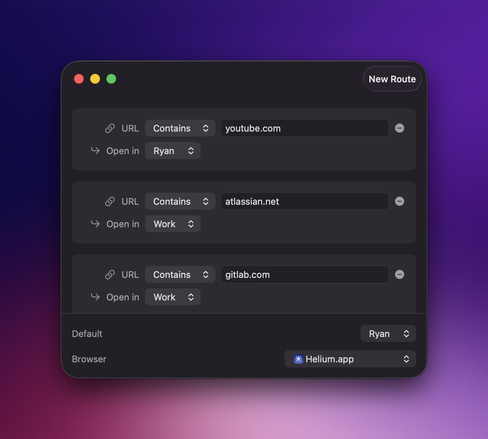

<p align="center">
  
</p>

# Switchboard

A macOS URL router that opens external links in different browser profiles based on patterns you define.

Set Switchboard as your default browser, and it will automatically open URLs in the right Chrome/Chromium profile.

>Note: Switchboard should work with any Chromium browser that uses the standard profile system, but it has only been tested with Helium.
## Installation

1. Make sure Command Line Tools for Xcode are installed
```bash
xcode-select --install
```
2. Run `make install`
3. Open the Switchboard app to register with the system
4. Go to **System Settings → Desktop & Dock → Default web browser** and select Switchboard

## Configuration

Launch Switchboard to open the configuration window. From there you can:

- Add routes with URL patterns (substring or exact match)
- Assign each route to a browser profile
- Set a default profile for unmatched URLs
- Choose your Chromium-based browser



Routes are evaluated in order—first match wins.

Any URL not matching a route opens in your default profile.

## How It Works

Switchboard runs silently in the background. When you click a link anywhere on your Mac, it:

1. Checks the URL against your routes
2. Opens the matching profile (or default)
3. Exits immediately

No dock icon. No menu bar clutter. Just routing.

## Requirements

- macOS 14+
- Any Chromium-based browser (Chrome, Helium, Brave, etc.)
